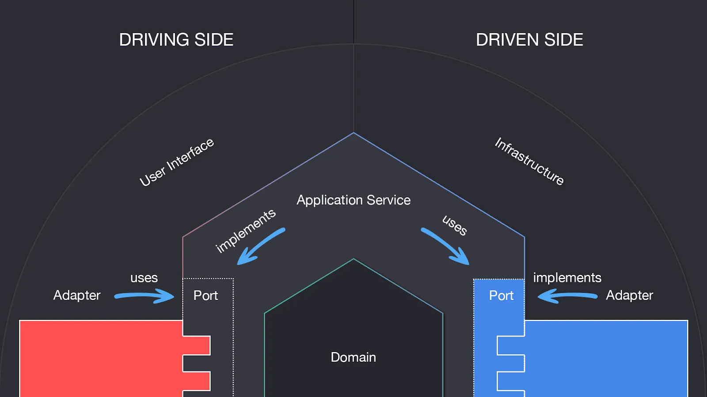

# Tech Challenge Fiap - Fase 1

- [Tech Challenge Fiap - Fase 1](tech-challeng-fiap-fase-1)
  - [Arquitetura](arquitetura)
  - [Estrutura de pastas](estrutura-de-pastas)

## Como rodar?

Para rodar, basta ter o Docker instalado em sua máquina e rodar o seguinte comando:

```shell
docker compose up -d
```

Após ter rodado o comando acima, será possível acessar o Swagger por meio do endpoint:

https://localhost:8080/swagger-api/index.html

## Arquitetura

Para desenvolvimento do projeto, foi utilizado a Arquitetura Hexagonal.


Fonte: https://community.revelo.com.br/o-que-e-arquitetura-de-software/ 

## Estrutura de pastas

```
.
└── src/
    ├── application/
    │   ├── exceptions
    │   ├── ports
    │   └── services
    ├── domain/
    │   ├── entities
    │   ├── enums
    │   └── valueobjects
    ├── infrastructure/
    │   └── repositories
    └── userinterface/
        └── controllers
```
