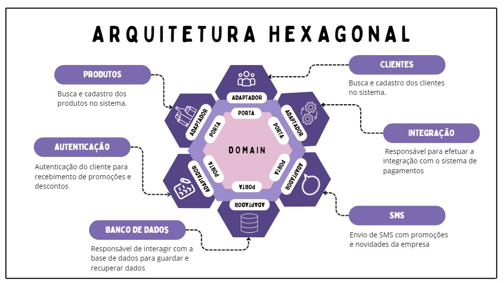
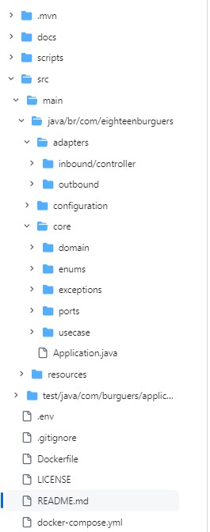

## Descrição Geral

O 18Burguers é um sistema de autoatendimento desenvolvido para a lanchonete de mesmo nome com objetivo principal de oferecer aos seus clientes  uma experiência eficiente, única e confiável na realização de pedidos, desde a seleção dos produtos até a sua entrega final.

## Objetivo do Sistema

O objetivo principal do 18Burguers é fornecer um sistema de autoatendimento que permita aos clientes realizar pedidos de maneira autônoma e personalizada, garantindo eficiência e precisão na gestão dos pedidos até a sua entrega.

## Tecnologias Utilizadas

-   Java
-   Spring Boot
-   PostgreSQL
-   Docker

## Pré-requisitos

-   Docker e Docker Compose instalados

## Instalação

1.  Clone o repositório:
   ```shell
git clone https://github.com/igorpk10/18burguers.git
 ```
2.  Navegue até o diretório do projeto:

  ```shell
cd 18Burguers
  ```

3.  Suba os containers Docker:

  ```shell
docker-compose up -d
  ```

## Uso Básico

Após a instalação e configuração dos containers Docker, utilize os endpoints documentados no [Swagger](./docs/swagger/18burguers_swagger.yaml) para interagir com o sistema.

## Funcionalidades Principais

-   Cadastro e consulta de clientes
-   Cadastro, edição e deleção de produtos
-   Criação de pedidos conforme a escolha dos produtos
-   Simulação de checkout e consumo de serviço de pagamento

## Arquitetura

O sistema utiliza uma arquitetura hexagonal, promovendo a separação de responsabilidades e facilitando a manutenção e escalabilidade.




## Estrutura de Pastas




## Banco de Dados

O sistema utiliza PostgreSQL. Dentro do projeto, há scripts para criação e alimentação das tabelas necessárias.


## Roadmap

-   Refatoração baseada no Clean Code e Clean Architecture
-   Integração com o sistema de pagamento do Mercado Livre
-   Implementação da arquitetura em Kubernetes

## Contato

-   Angela Giampaoli - [GitHub](https://github.com/angelazgiampaoli) | [LinkedIn](https://www.linkedin.com/in/angelazoldangiampaoli/)
-   Gabriel Nogueira - [GitHub](https://github.com/gabrielmvnog) | [LinkedIn](https://www.linkedin.com/in/gabrielmvnogueira/)
-   Igor da Costa - [GitHub](https://github.com/igorpk10) | [LinkedIn](https://www.linkedin.com/in/igao/)
-   Marcus Pioner - [GitHub](https://github.com/marcuspionerfiap) | [LinkedIn](https://www.linkedin.com/in/marcus-pioner-923237113/)
-   Mauricio Silva - [GitHub](https://github.com/mauriciolimas) | [LinkedIn](https://www.linkedin.com/in/mauricio-lima-silva-546041141/)
